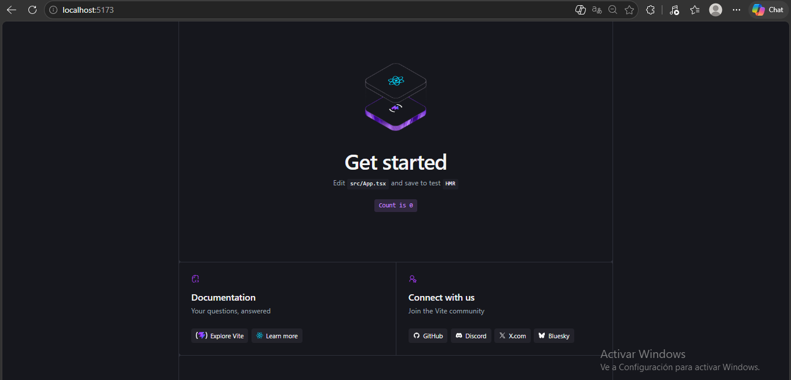
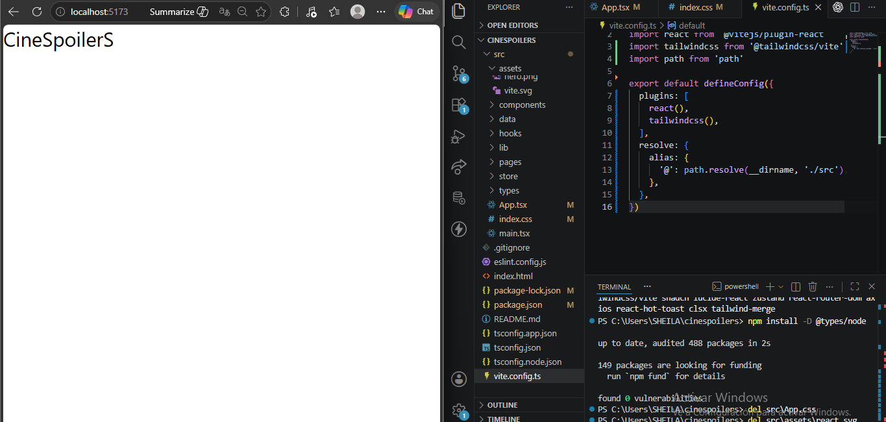
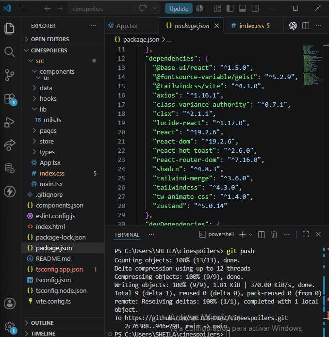
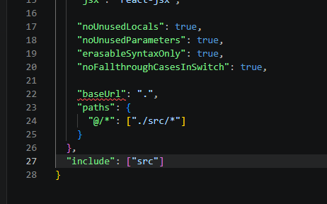
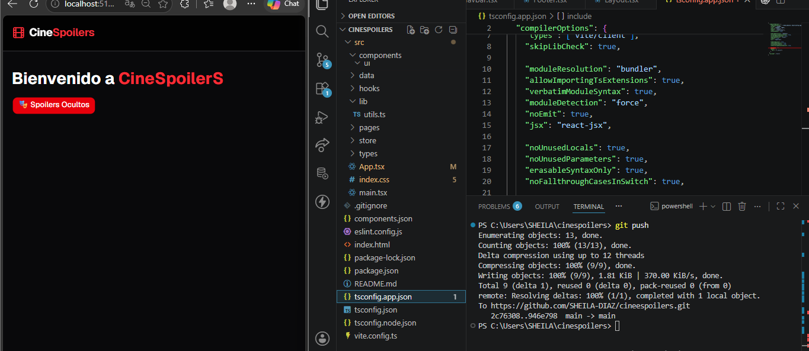
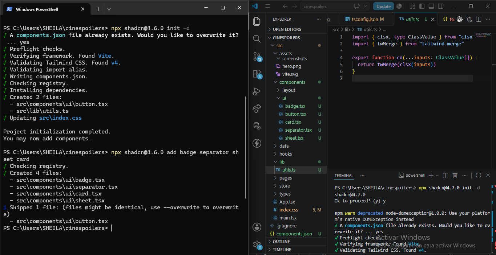
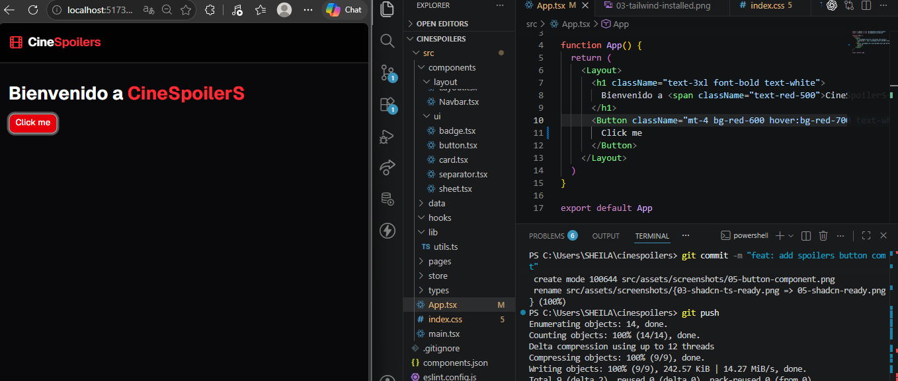
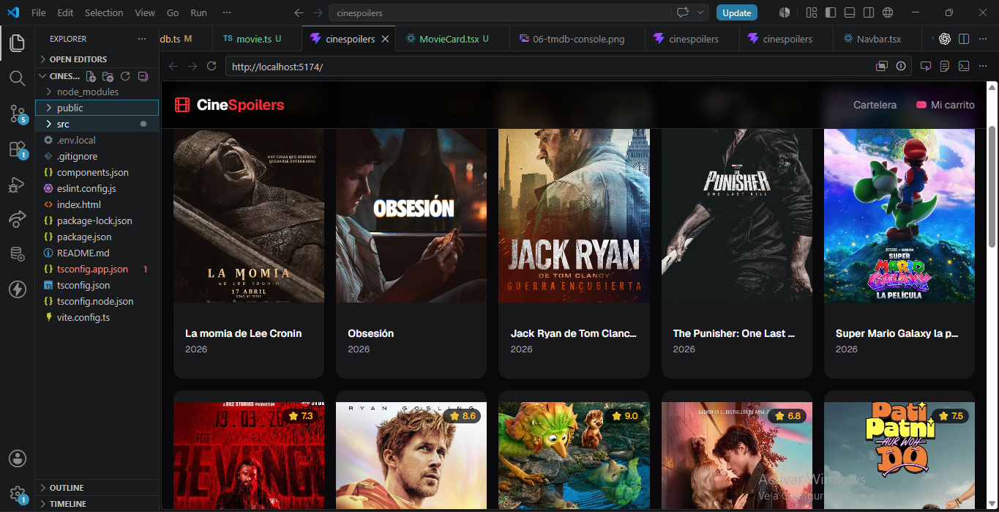
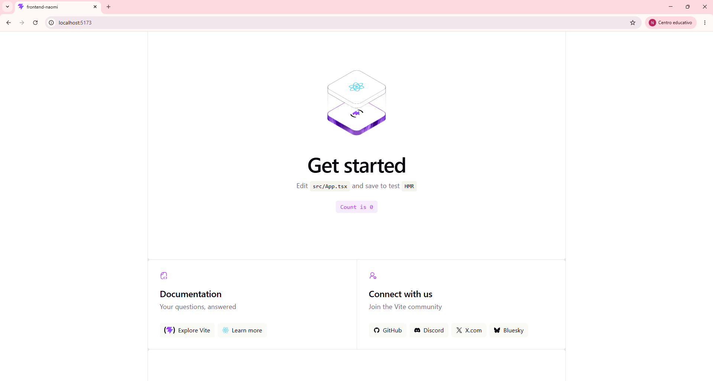

# 🎬 CineSpoilerS
E-commerce de tickets de cine construido con React + TypeScript + Vite.

## Author
- Sheila Diaz Rojas

## Tech Stack
- ⚛️ React 19 + TypeScript
- ⚡ Vite 8
- 🎨 Tailwind CSS v4
- 🧩 Shadcn/ui
- 🐻 Zustand
- 🌐 Axios + TMDB API
- 🛣️ React Router DOM

## Features
- 🎥 Catálogo de películas en cartelera (TMDB API)
- 🌑 UI oscura y minimalista
- 🧩 Componentes reutilizables con Shadcn

## Getting Started
```bash
git clone https://github.com/SHEILA-DIAZ/cineespoilers.git
cd cinespoilers
npm install
npm run dev
```

Crea un archivo `.env.local`:
```env
VITE_TMDB_API_KEY=tu_api_key
VITE_TMDB_TOKEN=tu_token
VITE_TMDB_BASE_URL=https://api.themoviedb.org/3
```

## Screenshots
### Sheila Diaz Rojas

#### 01 - React + Vite Running


#### 02 - Clean Dev Environment


#### 03 - Tailwind Installed


#### 04 - Alias Config


#### 05 - Button Component


#### 06 - Shadcn Ready


#### 07 - TMDB Console


#### 08 - Movies Grid


### Naomi Sanchez

#### 01 - React + Vite Running
